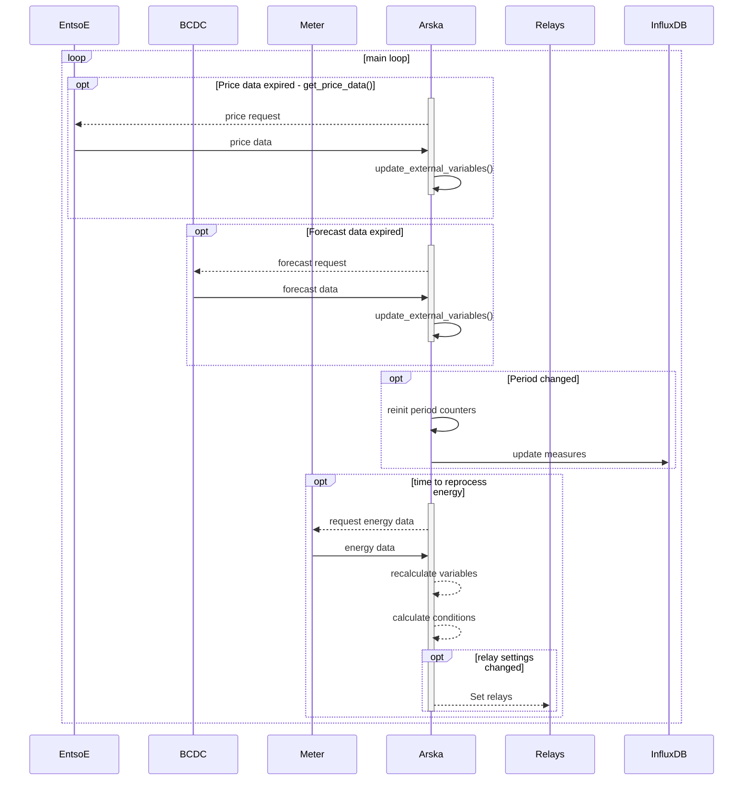

```mermaid
sequenceDiagram
%% https://mermaid-js.github.io/mermaid/#/sequenceDiagram
%% kannattaisiko Arska jakaa cache, variables jne
participant EntsoE
participant BCDC
participant Meter
participant Arska
participant Relays
participant InfluxDB

    
    loop main loop
    opt Price data expired - get_price_data()
    activate Arska
    Arska-->>EntsoE: price request
    EntsoE->>Arska: price data
    Arska->>Arska: update_external_variables()
    deactivate Arska
    end
    
    
    opt Forecast data expired
    activate Arska
    Arska-->>BCDC: forecast request
    BCDC->>Arska: forecast data
    Arska->>Arska: update_external_variables()
    deactivate Arska 
    end
   
    opt  Period changed
        Arska->>Arska: reinit period counters
        Arska->>InfluxDB: update measures
    end
    opt time to reprocess energy
    
     activate Arska  
     Arska-->>Meter: request energy data
     Meter->>Arska: energy data
     Arska-->>Arska: recalculate variables
     Arska-->>Arska: calculate conditions
     opt relay settings changed
        Arska-->>Relays: Set relays
     end
     deactivate Arska
    end
    End


   

   
```

